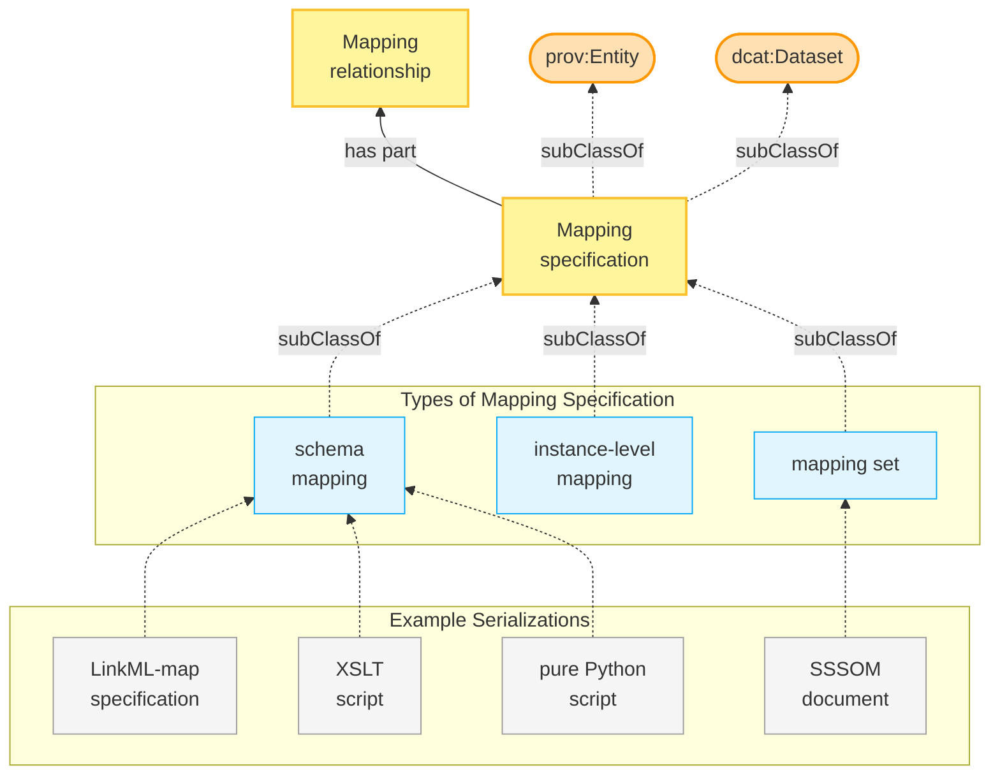
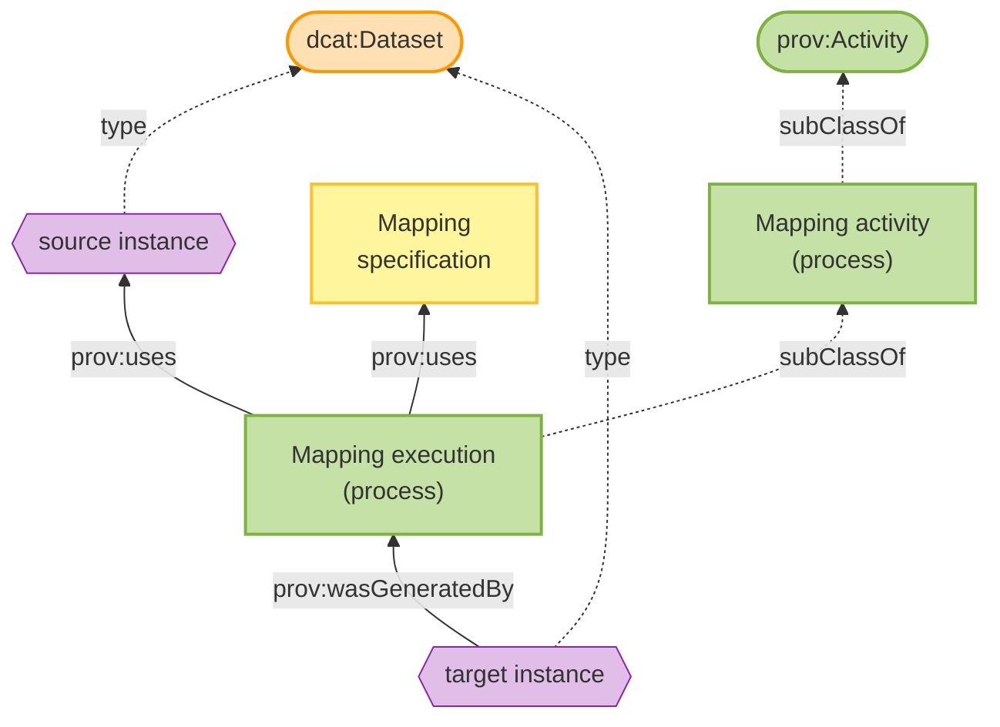

# Conceptual Model

This page describes the high-level conceptual model used by the FAIR Mappings Working Group to classify and describe different types of mappings and mapping-related activities.

!!! warning

    The terminology and definitions on this page are preliminary and subject to change based on community feedback.

## Overview

The conceptual model provides a common vocabulary for discussing mappings across different domains and use cases. It distinguishes between the *specification* of mappings (what is being mapped and how) and the *execution* of mappings (the process of applying mappings to transform data).

### Mapping Specification

A mapping specification is composed of mapping relationships and can be categorized into schema mappings, instance-level mappings, or mapping sets. See [Mapping Specification](#mapping-specification_1) for details.

### Mapping Execution

A mapping execution uses a mapping specification and a source instance as inputs, and generates a target instance as output. See [Mapping Execution](#mapping-execution_1) for details.

??? note "View original diagram"

    

## Core Concepts

### Mapping Specification

A **mapping specification** is a documented description of correspondences between elements in different information systems, schemas, or vocabularies. It serves as the central concept in our model.

A mapping specification:

- Is both a **dataset** (can be published, versioned, and cited) and an **entity** (can be tracked through provenance)
- Contains one or more **mapping relationships** as its parts
- Can be serialized in various formats (e.g., SSSOM, LinkML-Map, XSLT, Python scripts)
- Should include metadata for findability and reusability (see [Recommendations](recommendation.md))

### Mapping Relationship

A **mapping relationship** is a correspondence within a mapping specification that relates one or more source elements to one or more target elements. Mapping relationships can range from simple equivalence assertions to complex transformation rules.

A mapping relationship may specify:

- One or more **source elements**
- One or more **objects** (target elements being mapped to)
- A **predicate** or **relation** describing how subjects and objects correspond (e.g., `skos:exactMatch`, `skos:broadMatch`, `owl:equivalentClass`)
- **Transformation rules** defining how source values are converted to target values (e.g., concatenation, splitting, unit conversion, conditional logic)
- **Constraints** that must be satisfied for the mapping to apply (e.g., value ranges, cardinality restrictions, conditional applicability)
- Optional **metadata** such as confidence scores, justifications, or provenance

Mapping relationships can be **n:n**, meaning a single relationship may involve multiple source elements mapping to multiple target elements simultaneously, which is common in schema mappings where fields need to be merged, split, or restructured.

### Types of Mapping Specifications

The model distinguishes two primary types of mapping specifications:

#### Schema Mapping

A **schema mapping** describes correspondences between structural elements of different schemas, data models, or metadata standards. Schema mappings operate at the level of classes, properties, fields, or other structural components.

Examples include:

- Mapping between DCAT-AP and Schema.org metadata schemas
- Mapping between a relational database schema and an RDF ontology
- Mapping between different versions of a data standard

Schema mappings often require transformation logic beyond simple equivalence statements, such as:

- Combining multiple source fields into one target field
- Splitting one source field into multiple target fields
- Applying functions or lookups during transformation

#### Instance-Level Mapping

An **instance-level mapping** describes how a single dataset instance is transformed into a different form. Unlike schema mappings, instance-level mappings make no assumptions about schema generality—the transformation code is specific to that particular source instance and is not expected to work for arbitrary instances that might conform to the same schema.

Characteristics of instance-level mappings:

- Tailored to a specific source dataset instance
- May include hard-coded values, instance-specific logic, or bespoke transformations
- Not designed to be reusable across different datasets of the same type
- Often created for one-off data migration or integration tasks

Examples include:

- A custom script to transform a specific legacy database export into a new format
- A one-time transformation of a particular CSV file into RDF
- An ad-hoc conversion of a single institution's data dump

#### Mapping Set

A **mapping set** is a type of mapping specification that groups predicate-based mapping relationships together, typically in the form of subject, (mapping) predicate, object triples along with additional metadata. A mapping set is often the unit of publication and sharing.

A mapping set:

- Is a type of **mapping specification**
- Groups related mapping relationships
- Has its own metadata (author, license, version, etc.)
- Can be published as a standalone artifact
- Is commonly serialized as an **SSSOM document**

### Mapping Activity

A **mapping activity** is a type of provenance activity (`prov:Activity`) representing the broader process of creating, maintaining, or applying mappings. This includes activities such as:

- Authoring new mapping specifications
- Reviewing and validating existing mappings
- Executing mappings to transform data
- Updating mappings when source or target systems change

### Mapping Execution

**Mapping execution** is a specific type of mapping activity focused on applying a mapping specification to transform actual data.

Key aspects of mapping execution:

- It is a **subtype of mapping activity**
- It takes a **mapping specification** as input
- It takes a **source instance** (the data to be transformed) as input
- It produces a **target instance** (the transformed data) as output
- Different mapping specifications may require different execution environments or tools

Both **source instance** and **target instance** are datasets that can be cataloged, versioned, and discovered through standard data catalog infrastructure.

## Serialization Formats

Mapping specifications can be serialized in various formats depending on the type of mapping and intended use:

| Format | Typical Use Case |
|--------|------------------|
| **SSSOM document** | Mapping sets, particularly for ontology terms or identifiers |
| **LinkML-Map specification** | Schema mappings with transformation logic |
| **XSLT script** | XML-based schema transformations |
| **Python script** | Complex programmatic transformations |

The choice of serialization format depends on factors such as:

- The complexity of the mapping logic required
- The source and target data formats
- Tooling availability and community adoption
- Requirements for human readability vs. machine executability
- Requirements for reusability / composability.
- Does the format support easy mix-and-match type of mapping specification creation?

## Relationship to Standards

The conceptual model aligns with established standards:

- **DCAT** (Data Catalog Vocabulary): Mapping specifications are treated as datasets that can be cataloged and discovered
- **PROV** (Provenance Ontology): Mapping activities and executions are tracked as provenance activities, with clear inputs and outputs
- **SSSOM**: The recommended format for representing mapping sets
- **LinkML-Map**: A framework for schema mappings with executable transformation logic

## See Also

- [FAIR Mapping Recommendations](recommendation.md) - Technical recommendations for making mappings FAIR
- [Case Studies](use-cases.md) - Real-world examples of different mapping types
- [Resources](resources.md) - Tools and standards for working with mappings
- [The Semantic Mapping Vocabulary](https://mapping-commons.github.io/semantic-mapping-vocabulary/) - specifying some of the concepts from this code model (and more) as a formal RDF Vocabulary ([Browse on OLS](https://www.ebi.ac.uk/ols4/ontologies/semapv))
